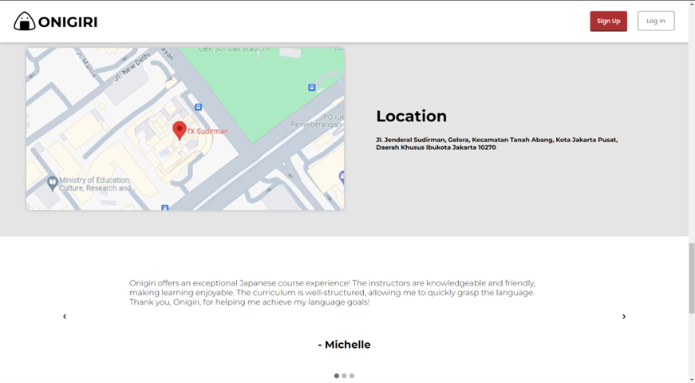

# Onigiri - Japanese Language Learning Website


## Introduction

Welcome to Onigiri, a user-friendly website that helps you learn Japanese. Watch our [Demo Video](https://drive.google.com/file/d/1Ruhw8eulvTay4zd8ZaTQ_8WC10lbK5V_/view) to see Onigiri in action, and explore the live version at [Onigiri Live](https://l1m1n4l.github.io/Onigiri-Project/). Our prototype includes a homepage, a dashboard, a pricing page with a checkout system, an all courses page covering grammar, kanji, and pronunciation, and a simulation quiz system for practicing the JLPT (Japanese-Language Proficiency Test).

## Overview

### 1. Homepage
The homepage is where you start. It introduces Onigiri's features and lets you easily go to different parts of the website.

### 2. Dashboard Page
Your personal space! Track your progress, see recent activities, and get suggestions based on how you like to learn.

### 3. Pricing Page with Checkout System
Check out our prices and subscribe for extra features. Get more resources and tools to boost your learning.

### 4. All Courses Page
Explore various courses on grammar, kanji, and pronunciation. Find and enroll in courses that match your learning goals.

### 5. Simulation Quiz System
Practice for the JLPT with our quiz system. It's like a real test to see how ready you are.

# Problem Analysis

Japanese language learning apps face challenges that impact their effectiveness:

1. **Kanji Instruction:**
   - Inadequate support for understanding and using kanji characters.

2. **Grammar Explanations:**
   - Lack of clear explanations for intricate grammar structures.

3. **Cultural Context:**
   - Ignoring cultural nuances in real-world communication.

4. **Personalization:**
   - Absence of features catering to diverse learning styles.

5. **Pronunciation Practice:**
   - Limited opportunities for speaking and listening exercises.

6. **Gamification Balance:**
   - Need for balancing engaging elements without causing fatigue.

7. **Technical Glitches:**
   - App crashes and slow loading times disrupt the learning experience.

8. **Feedback Mechanisms:**
   - Inadequate systems for tracking progress and improvement.

9. **Cost and Accessibility:**
   - Cost considerations and language support limit user accessibility.

Addressing these challenges through strategic improvements can enhance the Japanese language learning app experience.

## Video Demo
To access the video demo, click [here](https://drive.google.com/folderview?id=1obphzakritgfmw5dzxwd-tb34abscteb). The video covers the following aspects:

### 1. Signing Up
Learn how to create your Onigiri account to personalize your Japanese learning journey.

### 2. Progress Tracking
Explore the progress tracking feature, which allows you to monitor and analyze your advancements in language proficiency.

### 3. JLPT Simulations
Prepare for the Japanese Language Proficiency Test (JLPT) with Onigiri's simulation exercises.

### 4. Browsing Courses
Navigate through the diverse range of courses available on the website, catering to different learning preferences.

### 5. Kanji Learning
Discover the process of learning and practicing kanji characters using Onigiri's comprehensive resources.

### 6. Grammar and Pronunciation
Engage in exercises specifically designed to enhance your grasp of Japanese grammar and pronunciation.

### 7. Course Packages
Learn about the option to purchase additional course packages, unlocking new learning materials and features.

# Prototype

## Screenshots

### Home Page



### Login Page


### Signup Page


### Dashboard


### All Courses


### Pricing Page


### Simulation


### Check Out Page


### Course Introduction - Grammar N5


### Material Page - Grammar N5


### Material Page - Kanji N5


### Material Page - Pronunciation N5


### N5 Simulation Start Page


### N5 Simulation Quiz


## Getting Started
If you're new to Onigiri and want to explore the project or contribute, follow these steps:

1. **Clone the Repository:**
    ```bash
    git clone https://github.com/yourusername/onigiri.git
    ```

2. **Explore the Code:**
    Browse through the project files to understand the architecture and implementation.

3. **Contribute:**
    Feel free to contribute by opening issues, submitting pull requests, or suggesting improvements.

## Feedback
Your feedback is valuable! If you have any suggestions, questions, or issues, please [open an issue](https://github.com/yourusername/onigiri/issues).

## License
This project is licensed under the [MIT License](LICENSE.md) - feel free to use, modify, and distribute the code.

Happy learning with Onigiri! 🍙📚

